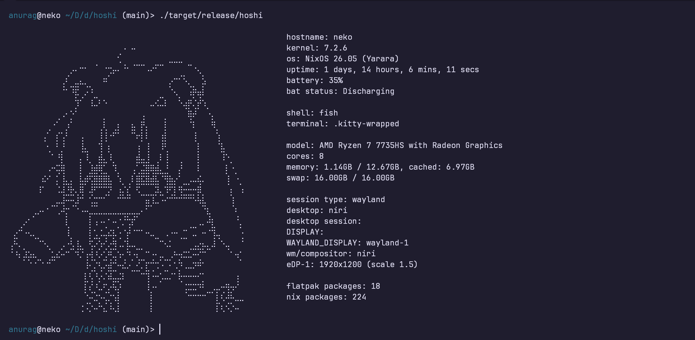

## hoshi - a smol fetch tool written in rust



## Benchmark

Simple execution-time benchmark of the release binary (`./target/release/hoshi`).

- **Runs:** 50
- **Average:** 32.87 ms
- **Median:** 32.75 ms
- **Min:** 31.24 ms
- **Max:** 35.00 ms

Benchmarked with:

```bash
for i in $(seq 1 50); do
  start=$EPOCHREALTIME
  ./target/release/hoshi >/dev/null 2>&1
  end=$EPOCHREALTIME
  awk -v s="$start" -v e="$end" 'BEGIN { printf "%.3f\n", (e-s)*1000 }'
done
```
